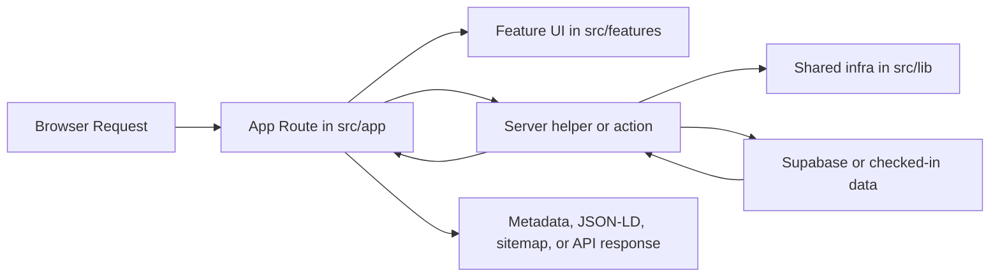

# Architecture Guide

This document gives a fast orientation to the current application structure so contributors can place new code in the right layer and avoid rebuilding old cross-feature bottlenecks.

## High-Level Shape

The app is a Next.js App Router project with a feature-oriented structure:

- `src/app` owns routes, route layouts, metadata entry points, and API handlers.
- `src/features` owns most domain logic, UI, feature-local helpers, and feature-owned server modules.
- `src/actions` owns shared server actions that are triggered by forms or client mutations.
- `src/lib` owns cross-feature infrastructure such as locale helpers, metadata builders, Supabase setup, security headers, and generic utilities.
- `src/content/grammar` owns typed grammar source content.
- `public/data` owns checked-in generated datasets consumed by the app and public API.
- `supabase` owns SQL migrations and Edge Functions.
- `tests/e2e` owns Playwright smoke coverage.

## Routing Model

The route tree is intentionally split into two main groups:

- `src/app/(site)/[locale]`
  Public localized pages such as `/en/dictionary`, `/nl/grammar`, and `/en/publications`.
- `src/app/(app)`
  Legacy non-localized routes and app-entry routes. Most of these redirect into localized public pages or host global utility pages like `/api-docs`, login, and auth callbacks.

That split supports two goals:

- public pages get stable localized URLs, canonical metadata, sitemap coverage, and structured data
- legacy paths remain supported without duplicating the real implementation

Dictionary routing follows this same model:

- `/[locale]/dictionary` is the localized search and browse surface.
- `/[locale]/entry/[id]` is the canonical localized dictionary entry route.
- `/dictionary` and `/entry/[id]` are legacy redirects.
- `/[locale]/dictionary/[id]` is intentionally not a canonical entry route.

## Main Layers

### 1. Route Layer

Use `src/app` for:

- page entry points
- route layouts
- `generateMetadata` and route-level metadata
- Next API route handlers
- sitemap and robots definitions

Pages should stay thin when possible. Prefer fetching or assembling view data in feature-owned helpers instead of growing large route files.

### 2. Feature Layer

Use `src/features/<feature>` for domain-specific code.

Typical subfolders:

- `components`
- `lib`
- `lib/server` for feature-owned server-side helpers and queries
- `hooks`
- `renderers`
- `build` for dataset transformation helpers where relevant

Examples:

- dictionary search and entry rendering live under `src/features/dictionary`
- grammar dataset, lesson rendering, reading/study workspace UI, API shaping, and learner state live under `src/features/grammar`
- public API documentation, Swagger UI wiring, and the combined OpenAPI document live under `src/features/api-docs`
- analytics dashboards and linguistic drill-downs live under `src/features/analytics`
- admin dashboard presentation, workspace modes, and queue UI live under `src/features/admin`

This is the default home for new product logic.

### 3. Server Actions

Use `src/actions` for reusable server actions that are not best colocated inside a single route.

Current pattern:

- top-level actions such as auth, contact, profile, and exercises stay as focused files
- admin actions are split by domain under `src/actions/admin`

Admin action domains currently include:

- submissions
- moderation
- releases
- audience
- shared admin context helpers

Keep `src/actions/admin.ts` as a thin public entrypoint, not a new logic hub.

### 4. Shared Infrastructure

Use `src/lib` for cross-feature utilities that are genuinely shared.

Examples:

- locale and routing helpers
- metadata and SEO helpers
- structured data builders
- CSP and security headers
- Supabase client/server wiring
- validation helpers
- server revalidation utilities

Shared code belongs here only when at least two features truly need it. If logic is feature-specific, keep it in the feature.

## Data and Content Flow

There are two main content sources in the project.

### Grammar Content

- Source of truth: `src/content/grammar`
- Generated output: `public/data/grammar/v1`
- Export command: `npm run data:grammar:export`

The grammar source is typed and reviewed in source form, then exported into JSON that is reused by:

- public pages
- the grammar API
- the OpenAPI docs surface
- sitemap freshness logic

### Dictionary Data

- Source of truth in the app runtime: `public/data/dictionary.json`

The dictionary currently ships from a normalized checked-in dataset and is read by the public dictionary UI, analytics drill-downs, the dictionary search API, and sitemap/SEO helpers.

The app-facing JSON should contain structured fields such as dialect forms, meanings, Greek equivalents, plural forms, and relation metadata. Raw/source-only text fields, attestations, and source notes should stay out of the runtime payload now that the data migration has been completed. The historical XML source can live in ignored local backups for reference, but it should not be tracked under `public/data` or imported by app code.

Dictionary part-of-speech codes, grammar abbreviations, and grammar-label tooltip behavior are centralized in `src/features/dictionary/grammarRegistry.ts` with matching tests. Prefer extending that registry over scattering one-off label parsing across UI, analytics, or structured-data helpers.

## SEO and Discoverability

SEO is centralized instead of being improvised page by page.

Main entry points:

- `src/lib/metadata.ts`
- `src/lib/structuredData.ts`
- `src/app/sitemap.ts`
- `src/app/robots.ts`
- `src/app/api/og/route.tsx`

Public localized pages should usually use the shared metadata helpers and, when appropriate, inject JSON-LD through `src/components/StructuredData.tsx`.

Private routes, redirect routes, and transient auth flows should use `noindex` metadata.

## Supabase and Background Work

The app uses Supabase in three layers:

- Next app auth and data access through `src/lib/supabase`
- SQL rollout through `supabase/migrations`
- background or webhook-style work through `supabase/functions`

Shared Edge Function logic lives under `supabase/functions/_shared`.

More involved workers should stay decomposed by responsibility instead of growing into single long files. The content release worker is a good example: its env/config, REST helpers, notification persistence, and broadcast delivery logic now live in separate modules under `supabase/functions/process-content-release`.

## Testing Strategy

Current testing layers:

- unit and integration-style coverage with Vitest in `src/**/*.test.ts`
- end-to-end smoke coverage with Playwright in `tests/e2e`
- CI enforcement in `.github/workflows/ci.yml`

Where a domain has enough behavior to justify it, prefer smaller domain-specific test files over one giant catch-all harness. The admin action tests now follow that pattern with shared helpers plus separate release, moderation, and audience test files.

CI currently runs:

- formatting check
- lint
- Vitest
- production build
- Playwright smoke tests

If you add routing, metadata, or SEO behavior, prefer small regression tests close to the helper or route surface.

## Placement Rules

When adding new code, use these defaults:

- New public page: `src/app/(site)/[locale]/...`
- Legacy redirect or utility route: `src/app/(app)/...`
- Feature-specific UI or logic: `src/features/<feature>/...`
- Feature-specific server query/helper: `src/features/<feature>/lib/server/...`
- Shared server action: `src/actions/...`
- Cross-feature utility: `src/lib/...`
- Grammar source content: `src/content/grammar/...`
- Generated grammar dataset: `public/data/grammar/v1/...`
- Migration or Edge Function work: `supabase/...`

## Conventions Worth Preserving

- Prefer feature-owned modules over new cross-feature megafiles.
- Keep page files and route handlers thin when extraction improves clarity.
- Split large client containers into orchestration plus smaller layout or interaction helpers once multiple modes, panels, or drill-down behaviors accumulate.
- Keep SEO logic centralized in shared helpers.
- Treat `public/data` as generated or checked-in data, not the place for new business logic.
- Use compatibility shims only as temporary migration tools, then remove them once imports are updated.
- Add tests for behavior that affects routing, metadata, structured data, or public API contracts.

## Typical Request Flow

## When in Doubt

If a change feels like it could live in several places, prefer the narrowest home that still keeps the code discoverable:

- feature first
- shared infra second
- route layer only for route concerns

That bias keeps the codebase readable as the product grows.
