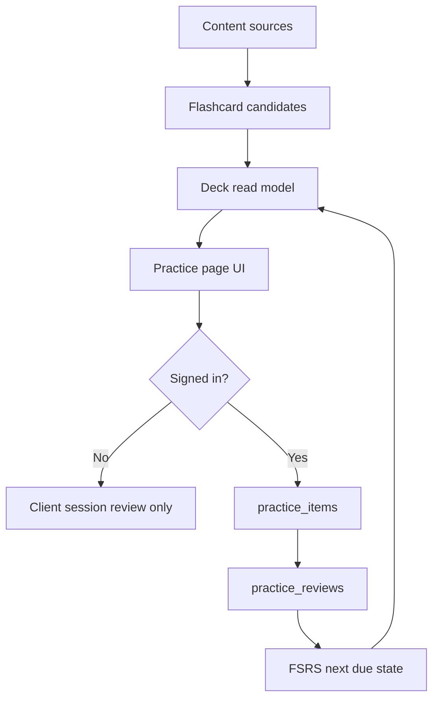

# Practice Feature

Practice is the learner-facing review surface for Coptic Compass. It presents
flashcard-style prompts for dictionary entries and grammar lesson material, but
the product name is **Practice** because the feature is broader than a card
game: it is a reusable spaced-repetition layer for language learning.

Use this document when changing the Practice UI, adding decks, expanding into
new content types, or touching persistence.

## Current Behavior

Practice lives at `/:locale/practice` and is implemented under
`src/features/practice`.

The current deck families are:

| Family  | Examples                                     | Availability         |
| ------- | -------------------------------------------- | -------------------- |
| Mixed   | `mixed-dictionary-grammar`                   | Public               |
| Words   | `bohairic-nouns`, `sahidic-verbs`, loanwords | Public               |
| Grammar | `grammar-lesson-1`                           | Public               |
| Saved   | `saved-entries`                              | Signed-in users only |

The default Practice deck is `mixed-dictionary-grammar`. Contextual entry
points use narrower defaults:

- Dictionary pages link to `bohairic-nouns`.
- Grammar pages link to `grammar-lesson-1`.
- The main Practice nav link opens the mixed deck.

Users can change deck, choose practice mode, refine filters, reveal answers,
type answers for suitable prompts, and rate reviews as `Again`, `Hard`, `Good`,
or `Easy`.

### Interaction Mechanics

#### 3D Card Flip Animation

Flashcards are rendered as 3D physical objects using CSS perspective transforms.

- **State Transition**: The card transitions smoothly along the Y-axis when `isRevealed` toggles.
- **Layout Stability**: The card container keeps a stable height (`h-[24rem] sm:h-[26rem] md:h-[30rem]`) to avoid layout shifts. Tall card backs scroll within the card body (`overflow-y-auto`).

#### Global Keyboard Shortcuts

To allow high-speed, keyboard-driven study sessions, the following shortcuts are active when the user is _not_ typing in input fields (such as Coptic character typing cards):

| Key               | Action                                                                        |
| ----------------- | ----------------------------------------------------------------------------- |
| `Space` / `Enter` | Reveals the card back (if hidden) or rates the card as **Good** (if revealed) |
| `1`               | Rates the card as **Again** (once revealed)                                   |
| `2`               | Rates the card as **Hard** (once revealed)                                    |
| `3`               | Rates the card as **Good** (once revealed)                                    |
| `4`               | Rates the card as **Easy** (once revealed)                                    |
| `R` / `V`         | Replays the current Coptic audio pronunciation                                |
| `H`               | Toggles the card hint                                                         |

#### Practice Setup Control Panel

The Practice Setup panel allows students to configure their active study session.

- **Unified Collapsible Layout**: The panel is collapsible on all viewport sizes. It initializes collapsed on mobile (`< 768px`) and expanded on desktop (`>= 768px`), allowing users to toggle it manually to maximize card viewing space.
- **Collapsed Configuration Summary**: When collapsed, the panel header displays color-coded summary pills of the active study mode and active filters (e.g. `Learn new` • `All prompt types`), ensuring instant context.
- **New Tab Links**: Links within the answer context card details (e.g. "Open entry") open in new tabs (`target="_blank"`) to prevent accidental session resets.

## Signed-In vs Anonymous Users

Practice is intentionally useful before sign-in, but persistence is signed-in.

Anonymous users can:

- Open public generated decks.
- Review prompts in the current client session.
- Use filters, deck picker, reveal mode, and typed-answer mode.
- Receive a call to action explaining that progress is not being saved.

Anonymous users cannot:

- Open saved-entry/private decks.
- Persist due dates, review history, or weak-card history.

Signed-in users can:

- Open public generated decks and private saved-entry decks.
- Materialize a generated prompt into a persisted `practice_items` row on first
  review.
- Save every review as an immutable `practice_reviews` event.
- Resume due/new/scheduled state from Supabase.
- Build weak-card state from recent review history.

If Supabase is unavailable or tables are missing, the feature should degrade to
a storage-blocked state instead of pretending progress is saved.

## Mental Model

Practice is built in layers:



The important split:

- **Candidates** are generated from source content and can be public.
- **Practice items** are persisted scheduler rows owned by one user.
- **Practice reviews** are append-only events from a user rating a persisted
  practice item.

## Key Files

| Concern                 | File or directory                                         |
| ----------------------- | --------------------------------------------------------- |
| Public route            | `src/app/(site)/[locale]/practice/page.tsx`               |
| Client UI               | `src/features/practice/components/PracticePageClient.tsx` |
| Server page data        | `src/features/practice/lib/server/pageData.ts`            |
| Server actions          | `src/actions/practice.ts`                                 |
| Persistence queries     | `src/features/practice/lib/server/queries.ts`             |
| FSRS adapter            | `src/features/practice/lib/fsrsScheduler.ts`              |
| Core card/deck types    | `src/features/practice/lib/core.ts`                       |
| Deck registry           | `src/features/practice/lib/deckRegistry.ts`               |
| Dictionary card builder | `src/features/practice/lib/dictionaryFlashcards.ts`       |
| Grammar card builder    | `src/features/practice/lib/grammarFlashcards.ts`          |
| Translations            | `src/lib/translations/practice.ts`                        |
| Database types          | `src/types/supabase.ts`                                   |

The product namespace is Practice. The term `flashcard` remains valid inside
the card-generation layer where it describes an actual prompt/answer card,
template, scheduler card, or grammar flashcard seed.

## FSRS Scheduling

Practice uses `ts-fsrs` through the adapter in
`src/features/practice/lib/fsrsScheduler.ts`.

FSRS stands for Free Spaced Repetition Scheduler. The core idea is that a review
rating updates a memory model for the item, especially its stability,
difficulty, state, and next due date. Instead of using fixed intervals like
"show again tomorrow", FSRS calculates a next due time from the previous card
state and the learner's rating.

The app stores the serialized FSRS card in `practice_items.scheduler_card`.
Every review stores:

- the rating submitted by the learner;
- the reviewed timestamp;
- the next serialized scheduler card;
- the FSRS review log;
- source identity fields for future analytics.

The public app rating scale maps directly to FSRS grades:

| App rating | FSRS grade     | Meaning in UI                           |
| ---------- | -------------- | --------------------------------------- |
| `again`    | `Rating.Again` | Missed or needs immediate reinforcement |
| `hard`     | `Rating.Hard`  | Remembered with effort                  |
| `good`     | `Rating.Good`  | Remembered normally                     |
| `easy`     | `Rating.Easy`  | Remembered easily                       |

Do not hand-roll due-date math in UI components. Use the FSRS adapter and keep
all serialized-card validation there.

## Persistence

The current database tables are:

- `practice_items`
- `practice_reviews`

`practice_items` is the user's scheduler state for a unique generated prompt.
The row identity is:

```text
user_id + source_type + source_id + template + locale + variant_key
```

`practice_reviews` is append-only review history for analytics, replay, and
weak-card behavior. Reviews point from `practice_reviews.practice_item_id` to
`practice_items.id`.

Current source types are:

- `dictionary`
- `grammar`

Adding another source type, such as manuscript practice or publication practice,
requires a database migration because `source_type` is constrained.

Row-level security should remain user-owned:

- users can read/insert/update/delete their own practice items;
- users can read their own reviews;
- users can insert reviews only for their own practice items;
- admins can read all rows.

Do not delete already-deployed migrations. If the schema needs another cleanup,
add a forward migration.

## Card Generation

A `FlashcardCandidate` is a generated, source-derived prompt. It is not a saved
database row by itself.

Each candidate contains:

- `sourceType`: currently `dictionary` or `grammar`;
- `sourceId`: stable source identity, such as a dictionary entry id or grammar
  seed id;
- `template`: the prompt/answer shape;
- `variantKey`: a stable variant identity, such as dialect or `default`;
- `front` and `back`: localized card sides;
- `metadata`: source-specific details for UI filters and context panels;
- optional links back to the dictionary entry or grammar lesson.

Dictionary candidates are built from lexical entries in
`dictionaryFlashcards.ts`. Grammar candidates are built from grammar flashcard
seed documents in `grammarFlashcards.ts`.

## Decks And Filters

Deck definitions decide what candidates are eligible for review. The deck
registry combines source adapters from dictionary and grammar, and the mixed
deck interleaves source lists.

The Practice page then builds a deck read model:

1. Generate candidate sources for the selected deck.
2. If signed in, load matching persisted practice items.
3. If signed in, load recent review history.
4. Join candidates to persisted rows.
5. Compute `due`, `new`, `scheduled`, and weak-card state.
6. Apply UI filters and study mode.

Deck filters should avoid redundant choices. For example, a deck already
scoped to Sahidic verbs should not make dialect and grammar feel like separate
primary decisions unless they further refine the current deck.

## Adding A Dictionary Deck

Most dictionary deck additions happen in
`src/features/practice/lib/dictionaryDecks.ts`.

Checklist:

1. Add a deck id to `DictionaryFlashcardDeckId`.
2. Add a deck definition with title/description translation keys.
3. Choose `scope` and templates.
4. Confirm generated candidate count is reasonable.
5. Add translations in `src/lib/translations/practice.ts`.
6. Update tests if the deck list or default behavior changes.

Use generated dictionary decks for broad public review. Use `saved-entries`
only for learner-owned saved dictionary entries.

## Adding Grammar Practice

Grammar practice begins in the grammar content layer:

1. Add grammar flashcard seed documents under `src/content/grammar/v1`.
2. Include them in the grammar registry.
3. Export the grammar data so `public/data/grammar/v1/flashcards.json` updates.
4. Add or expand a grammar deck definition in `grammarFlashcards.ts`.
5. Add translations for new deck titles, descriptions, templates, or side
   labels.
6. Add tests for candidate generation and deck registration.

The public `grammar/v1/flashcards.json` filename is intentionally still named
flashcards because it exports literal card seed data for grammar clients.

## Adding A New Source Type

For a new source type beyond dictionary and grammar:

1. Add the source type to the `practice_items.source_type` and
   `practice_reviews.source_type` check constraints with a forward migration.
2. Extend `FlashcardSourceType`.
3. Implement a source adapter that can return deck definitions and candidate
   sources.
4. Register it in `deckRegistry.ts`.
5. Teach page-data loading how to supply the source content.
6. Add translations and tests.

Keep the candidate identity stable. If `source_id`, `template`, or
`variant_key` changes later, existing user progress will no longer join to the
same generated prompt.

## Testing

Useful checks when changing Practice:

```bash
npm run typecheck
npm run lint
npm run format:check
npm run knip
npm run test
npm run build
npm run test:e2e
```

Focused tests live under `src/features/practice/lib/*.test.ts`,
`src/actions/practice.test.ts`, and `tests/e2e/practice.spec.ts`.

## Contributor Notes

- Prefer `practice` for product, route, database, action, and translation
  names.
- Use `flashcard` only when referring to the literal card model, card template,
  FSRS card state, or grammar seed export.
- Keep UI copy concise; the Practice surface should feel like a study tool, not
  a game.
- Keep generated decks public unless the deck depends on learner-owned data.
- Keep persistence user-owned and append reviews instead of overwriting history.
- Extend existing source adapters before inventing a new parallel deck system.
